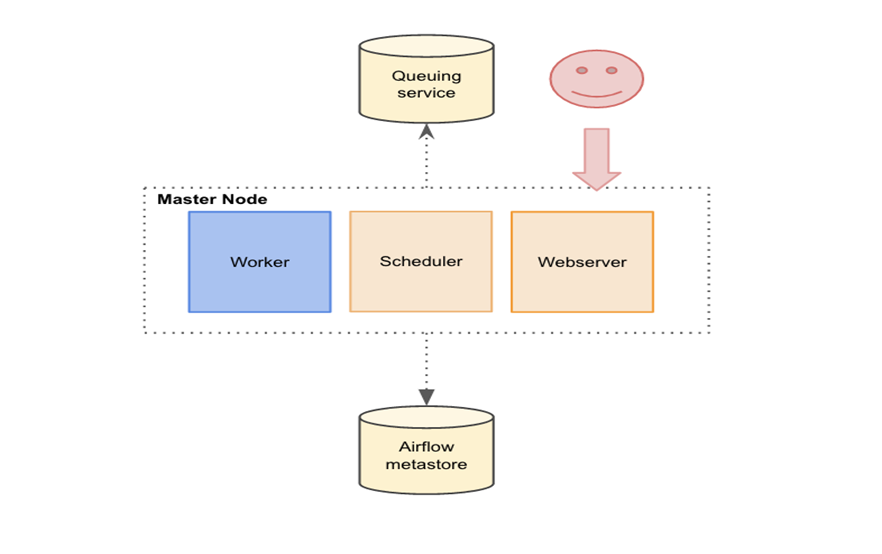
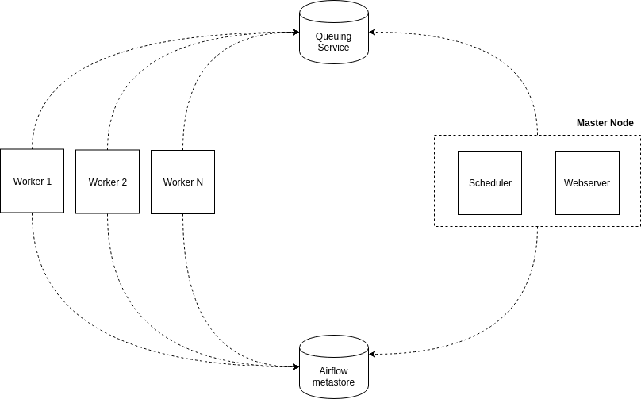

## que es
La arquitectura de Apache Airflow se basa en un enfoque de "flujo de trabajo dirigido por DAG" (Directed Acyclic Graph), en el que los DAG definen las relaciones y dependencias entre las tareas en un flujo de trabajo. Airflow se compone de varios componentes que trabajan juntos para permitir la creación, planificación y ejecución de flujos de trabajo complejos.

A continuación, te presento una imagen que muestra los componentes principales de la arquitectura de Airflow:

Los componentes principales de la arquitectura de Airflow son:

1. DAGs: Los DAGs son el corazón de Airflow. Definen la estructura y dependencias de las tareas en un flujo de trabajo. Los DAGs son archivos Python que contienen una o varias tareas que se ejecutan en un orden específico.

2. Scheduler: El Scheduler es el componente encargado de planificar y ejecutar las tareas en el orden definido por los DAGs. El Scheduler utiliza una base de datos para almacenar y rastrear el estado de las tareas.

3. Base de datos: La base de datos es un componente importante de la arquitectura de Airflow. Almacena metadatos y estado de las tareas, lo que permite al Scheduler planificar y ejecutar tareas de manera eficiente. Airflow admite diferentes tipos de bases de datos, como SQLite, MySQL y PostgreSQL.

4. Workers: Los Workers son los componentes que se encargan de ejecutar las tareas. Airflow utiliza un modelo de ejecución de tareas distribuido, lo que significa que varias instancias de Workers pueden ejecutar tareas simultáneamente en diferentes servidores.

5. Web Server: El Web Server es una interfaz web que permite a los usuarios interactuar con Airflow. Los usuarios pueden ver y modificar DAGs, ver el estado de las tareas y configurar Airflow a través de la interfaz web.

6. CLI: El CLI (Command Line Interface) es una herramienta que permite a los usuarios interactuar con Airflow a través de la línea de comandos. Los usuarios pueden iniciar y detener Airflow, ver el estado de las tareas y configurar Airflow utilizando comandos de la línea de comandos.

## airflow de un solo nodo

## airflow multinode

