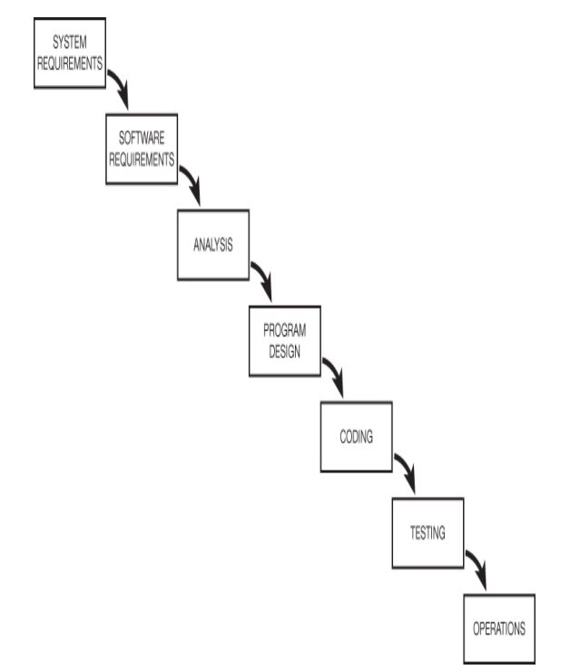

# Principios basicos

# Primer modelo de cascada

# Gestionar un proyecto
Para gestionar un proyecto debemos buscar cumplir con 4 puntos , bueno , barato , rapido y que este hecho , cada uno de estos puntos representa una meta , pero no es posible conseguir todos.

## team velocity 

numero de tareas y puntos que puede conseguir un equipo por semana.
(diagrama que se tiene que poner en un lugar visible)

## burd-down chart 

numero de puntos restantes para el siguiente hito importante 
(diagrama que se tiene que poner en un lugar visible)
## Fechas fijas

Al iniciar un proyecto las fechas son fijas , no se deben cambiar

# circulo de la vida agil

# 