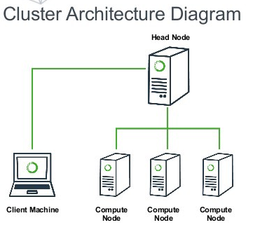
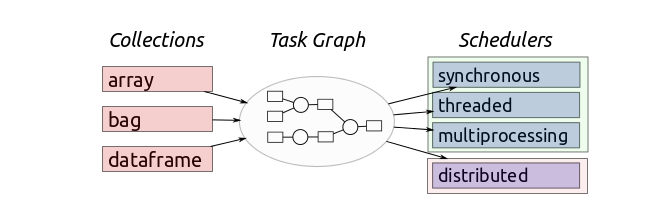
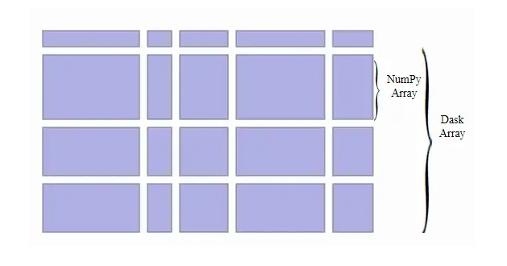
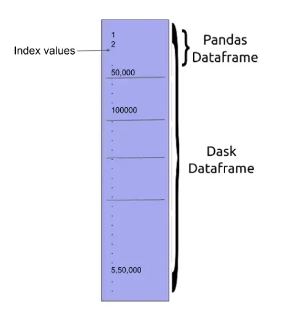

# Introduccion a dask

Al tratar con grandes volumenes de informacion, en algun momento esta informacion debera ser gestionada por la memoria RAM , en algunas ocaciones no podremos cargar en memoria tanta informacion

## dask como una solucion

Es una solucion de computo distribuido , nos permite trabajar con multiples cores.

Tiene una sintaxis muy similar a librerias muy conocidas como pandas o numpy

Distribuye nuestras tareas en pequeños batchs y los computa atravez de un task scheduler y un task worker

Hay herramientas parecidas como pyspark , pero dask es mas facil de migrar

## Que es el cluster computing 

Es el proceso de usar una o una serie de computadoras conectadas por una red rapida, trabajan juntas en forma paralela para formar un solo recurso computacional. (una computadora hecha de mas computadoras)



## tipos de dask schedulers

1. Single Machine
2. Distributed scheduler



El scheduler distribuido te permite ingresar a un dashboard en el puerto 8787 cuando el cluster se inicializa

## iniciar un cluster e inciar el clientes

```python

from dask.distributed import LocalCluster, Client
cluster = LocalCluster()
client = Client(cluster)
#To see where the port of the dashboard is, use this command
print(client.scheduler_info()['services'])
# {'dashboard': 8787} --> means you can access it at localhost:8787
```

## como trabaja dask a alto nivel

un array o un dataframe en dask se compone de chunks de df pandas o arrays numpy





