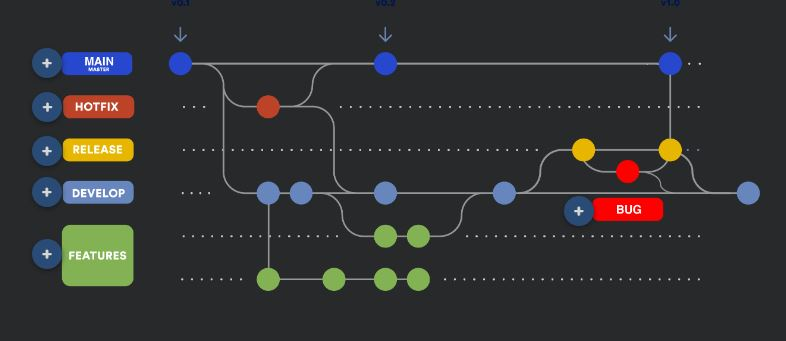
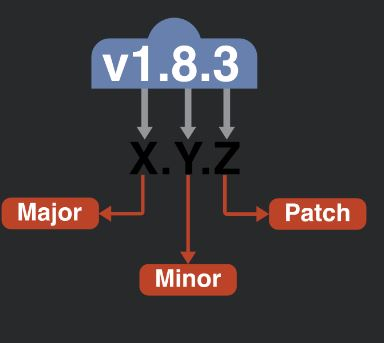

# Branches 

Main:
    
    Codigo listo para produccion , tiene un historico de las versiones de produccion con sus respectivos tags

Hotfix:
    
    Nombre: hotfix-[Bug id]
    Para arreglar errores en produccion

Release:

    Nombre: release-[version]
    Contiene versiones de codigo para ser estables
    Nace de la rama de develop para integrarse en el main branch

Develop:

    nace de la rama main, contiene los ultimos cambios para las siguientes versiones del software

Features:

    Nombre: feature-[dev id]
    contiene un nuevo desarollo o actualizacion , es integrada a develop

Bug:

    Nombre: bug-[version id]
    Usado para resolver problemas de produccion 
    Una vez solucionado se aghrega a la rama release y develop

# Versioning nomenclature

## Nomenclatura en ramas

Master:

    numeric only version v 1.0.0

Hotfix:
    
    indicar el ultimo argumento por ejemplo : v1.0.1

Release:

    version mas RC: v1.0.1-RC

Develop:

    v1.0.0-SNAPSHOT

Snapshot:

    igual

