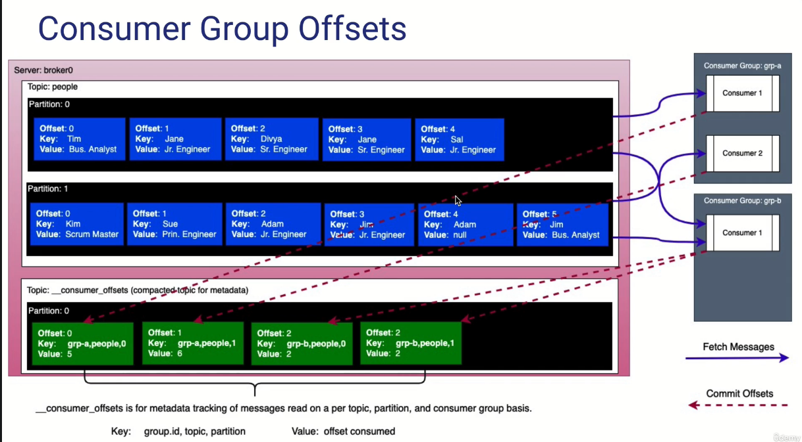

# consumidores en kafka

Los consumidores de Kafka son componentes que leen los mensajes publicados en los temas (topics) de Kafka y los procesan.

como funciona:

1. Suscripción a un tema: Un consumidor se suscribe a uno o más temas de Kafka para recibir los mensajes. Un tema es un flujo de registros ordenados y persistidos que se divide en particiones.

2. Particiones: Los temas de Kafka se dividen en una o más particiones para permitir la escalabilidad y el paralelismo en el procesamiento de los mensajes. Cada partición es secuencial y tiene un identificador único llamado "offset" que indica la posición de un mensaje dentro de la partición.

3. Consumo de mensajes: El consumidor comienza a leer mensajes desde la última posición conocida en cada partición a la que está suscrito. Inicialmente, esto puede ser el último offset consumido o el offset más antiguo. A medida que se consumen los mensajes, el consumidor realiza un seguimiento del offset más reciente procesado en cada partición.

4. Procesamiento de mensajes: Una vez que el consumidor recibe los mensajes, puede procesarlos según la lógica de negocio requerida. Esto puede incluir análisis en tiempo real, almacenamiento en una base de datos, indexación, agregaciones, entre otros. El procesamiento puede ser simple o complejo, dependiendo de los requisitos de la aplicación.

5. Control de commit y offset: Después de procesar un lote de mensajes, el consumidor debe confirmar explícitamente el progreso realizado, marcando el offset más reciente como "confirmado". Esto se conoce como "commit" en Kafka. Al hacerlo, el consumidor garantiza que los mensajes confirmados no se volverán a leer en caso de reinicio o fallo del consumidor.

6. Manejo de particiones: Kafka maneja automáticamente la distribución de las particiones entre los consumidores de un mismo grupo de consumidores (consumer group). Cada partición solo puede ser consumida por un consumidor dentro del grupo. Si se agregan o eliminan consumidores en un grupo, Kafka se encarga de redistribuir las particiones automáticamente.

# Como funciona un grupo de consumidores

1. Suscripción al mismo tema: Los consumidores que pertenecen al mismo grupo se suscriben al mismo tema (topic) en Kafka. Cada consumidor dentro del grupo leerá una o varias particiones del tema.

2. Distribución de particiones: Cuando un consumidor se une a un grupo, Kafka automáticamente asigna a ese consumidor una o varias particiones del tema. Cada partición es consumida exclusivamente por un solo consumidor dentro del grupo. Esto significa que si tienes más particiones que consumidores en el grupo, algunas particiones quedarán inactivas hasta que se unan más consumidores.

3. Procesamiento paralelo: Una vez que los consumidores están activos y asignados a las particiones, comienzan a leer los mensajes de Kafka y los procesan de manera paralela. Cada consumidor se encarga de leer los mensajes de las particiones que se le han asignado, lo que permite un procesamiento en paralelo y una mayor capacidad de procesamiento en general.

4. Equilibrio de carga: Kafka monitorea continuamente el estado de los consumidores en un grupo y, en caso de que se agreguen o se eliminen consumidores, realiza un equilibrio de carga redistribuyendo las particiones entre ellos. Esto asegura que cada consumidor tenga una carga equitativa y que todas las particiones se consuman de manera eficiente.

5. Paralelismo y tolerancia a fallos: El uso de un grupo de consumidores proporciona paralelismo en el procesamiento de mensajes y también permite la tolerancia a fallos. Si un consumidor dentro del grupo se desconecta o falla, Kafka automáticamente reasigna las particiones no procesadas a otros consumidores del grupo, evitando la pérdida de datos y garantizando que la carga de procesamiento se distribuya adecuadamente.

6. Coordinador del grupo: Cada grupo de consumidores tiene un coordinador designado en Kafka. El coordinador es responsable de asignar particiones a los consumidores, supervisar su estado y realizar el equilibrio de carga cuando sea necesario.

Este Kafka Groupo tiene un group-id debe de ser un nombre en especifico.

una vez leidos los mensajes , estos son enviados a __consumer_offsets que indica cuales mensajes ya han sido consumidos , tambien almacena el offset del siguiente mensaje a ser consumido , la key se forma por el group id , topic y offset del mensaje consumido , por su parte el offset del siguiente mensaje a consumir se alamcena en el value

## Comandos para ver group consumers 

    kafka-consumer-groups.sh --bootstrap-server <servidor-kafka> --list

Descripción:

--bootstrap-server: Especifica la dirección y el puerto del servidor de Kafka.
Este comando mostrará la lista de grupos de consumidores activos, uno por línea.

    kafka-consumer-groups.sh --bootstrap-server <servidor-kafka> --describe --group <nombre-grupo>

Descripción:

--bootstrap-server: Especifica la dirección y el puerto del servidor de Kafka.
--describe: Indica que se desea obtener información detallada del grupo de consumidores.
--group: Especifica el nombre del grupo de consumidores del cual deseas obtener información detallada.
Este comando mostrará una tabla con información sobre cada partición y su estado en el grupo de consumidores, incluyendo el offset actual, el offset final, el lag (retraso) y el propietario del consumidor.

La tabla contendrá las siguientes columnas:

TOPIC: El tema (topic) asociado a la partición.
PARTITION: El número de partición.
CURRENT-OFFSET: El offset actual del consumidor en esa partición.
LOG-END-OFFSET: El offset final (último offset) disponible en esa partición.
LAG: El lag (retraso) del consumidor en esa partición, que es la diferencia entre LOG-END-OFFSET y CURRENT-OFFSET.
CONSUMER-ID: El ID del consumidor que está asignado a esa partición.

## Actualizar offsets de grupos 

    kafka-consumer-groups.sh --bootstrap-server <servidor-kafka> --group <nombre-grupo> --topic <nombre-tema> --reset-offsets --to-offset <nuevo-offset> [--execute]

Por supuesto, el comando reset-offsets se utiliza para restablecer los offsets de un grupo de consumidores en un clúster de Kafka. Esto puede ser útil en diversas situaciones, como cuando se desea volver a procesar mensajes antiguos o reiniciar el procesamiento desde un punto específico en un tema.

El comando reset-offsets se ejecuta a través de la herramienta de línea de comandos kafka-consumer-groups.sh y requiere privilegios de administrador (--bootstrap-server).

Aquí tienes la estructura básica del comando reset-offsets:

shell
Copy code
kafka-consumer-groups.sh --bootstrap-server <servidor-kafka> --group <nombre-grupo> --topic <nombre-tema> --reset-offsets --to-offset <nuevo-offset> [--execute]
A continuación, se explica cada uno de los parámetros utilizados en el comando:

--bootstrap-server: Especifica la dirección y el puerto del servidor de Kafka.
--group: Especifica el nombre del grupo de consumidores del cual se restablecerán los offsets.
--topic: Especifica el nombre del tema (topic) en el que se restablecerán los offsets.
--reset-offsets: Indica que se realizará el restablecimiento de los offsets.
--to-offset: Especifica el nuevo offset al que se restablecerán las particiones. Puedes utilizar valores absolutos o relativos al prefijo - o + seguido del número de offset.
--execute: Este parámetro es opcional. Si se proporciona, se realizará la ejecución efectiva de la operación de restablecimiento de los offsets. Si no se proporciona, solo se mostrarán los resultados sin realizar cambios.
Es importante tener en cuenta que el comando reset-offsets solo afecta al grupo de consumidores especificado y no altera los offsets de otros grupos de consumidores.

Es fundamental tener precaución al utilizar este comando, ya que puede tener impactos significativos en el procesamiento de los mensajes. Se recomienda realizar pruebas en entornos de desarrollo o utilizarlo con cuidado en producción.

