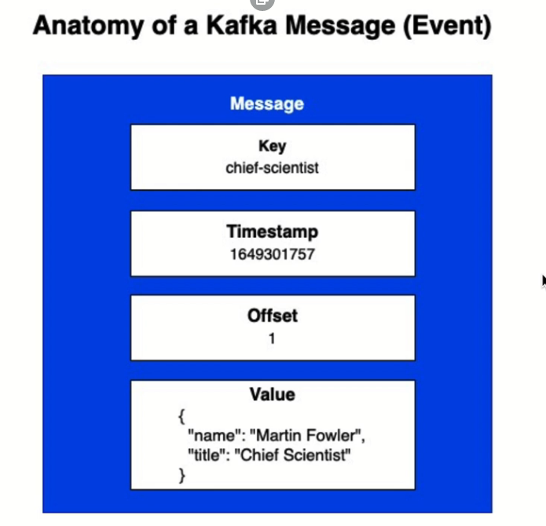
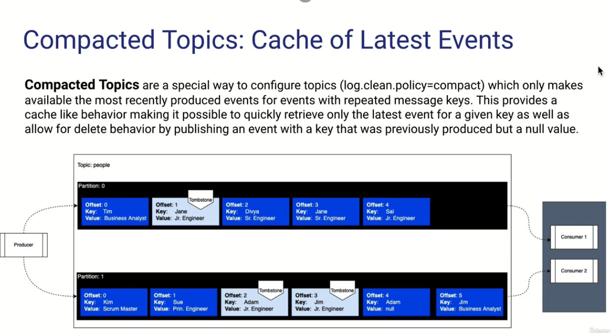

# Primer vistaso

El producer escribe mensajes o eventos en kafka 

El cosnumer obtiene estos mensajes o eventos de kafka

Los mensajes se mantienen por default dos semanas pero esto es configurable

Los mensajes son inmutables

# Segundo vistaso

Zookeper tiene metadata operacional sobre los brokers y su estado.

En nuevas versiones zookeper esta siendo depreciado.

# tercer vistaso

Un topico es un contenedor logico de un grupo de mensajes

Un topico tiene una o mas particiones (sub secciones del topico)

Es recomendable tener tantas particiones como consumidores

Descripcion: 

1. Productores: Son las aplicaciones que generan datos y los envían a Kafka en forma de mensajes.

2. Temas: Es una categoría o flujo de mensajes similar a una cola o una tabla de una base de datos. Los mensajes son almacenados en un tema y los consumidores pueden leerlos de allí.

3. Particiones: Cada tema puede dividirse en múltiples particiones, que son unidades de almacenamiento y procesamiento de mensajes independientes. Las particiones permiten que Kafka maneje grandes cantidades de datos y mejore el rendimiento.

4. Brokers: Son los servidores de Kafka que almacenan los datos y gestionan la comunicación entre productores y consumidores. Cada broker puede contener múltiples particiones de diferentes temas.

5. Consumidores: Son las aplicaciones que leen los datos de Kafka. Pueden leer datos de uno o varios temas y de una o varias particiones.

6. Grupos de consumidores: Los consumidores se organizan en grupos para leer los datos de un tema en paralelo. Cada partición en un tema solo puede ser leída por un consumidor dentro de un grupo. Esto significa que, si hay múltiples consumidores en un grupo, cada uno leerá datos de un subconjunto de las particiones disponibles.

## Arquitectura de un mensaje

La key es usada para filtrar o identificar un mensaje 

## Como se almacenan los mensajes

Mensajes con la misma key se almacenan en la misma particion

## Compacted topic

