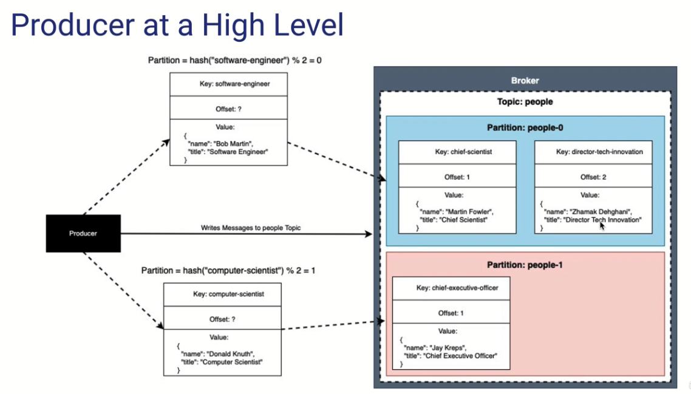
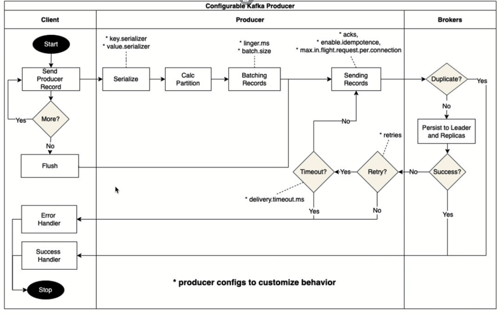

# Primer vistazo 

Cada key sufre una transformacion para asignarle una particion

Los mensajes con la misma key siempre van a la misma particion

## CLI Tools

En consola agregar mensajes a un topic en especifico

    kafka-console-producer --bootstrap-server broker@:29092 --topic people
    > ["name":" "Martin Fowler", "title":"Chief Scientist"}

Agregar un topic en especifico con una key

    kafka-console-producer --bootstrap-server broker0:29092 --topic people --property “parse.key=true" --property "key.separator=|"
    >key | ["name":" "Martin Fowler", "title":"Chief Scientist"}

Mostrar mensajes de un topic

    kafka-console-consumer --boostrap-server broker0:29092 --topic people  --from-beginning

Mostrar mensajes de un topic con key

    kafka-console-consumer --boostrap-server broker0:29092 --topic people  --from-beginning --property "print.key=true"

## Ciclo del producer

 El batching de registros en Kafka permite al productor enviar varios mensajes en una sola llamada a la API, lo que mejora el rendimiento general del productor. Los parámetros **batch.size** y **linger.ms** se utilizan para configurar el batching y controlar el tamaño y el tiempo de espera máximo de los lotes.