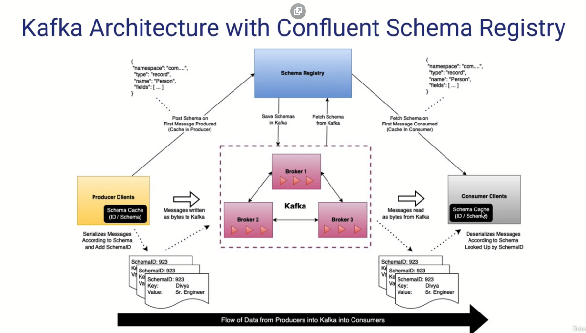

# Schema registry

Un Schema Registry (Registro de Esquemas) es un componente importante en el ecosistema de Apache Kafka que se utiliza para gestionar los esquemas de datos utilizados por los productores y consumidores de Kafka. Permite garantizar la compatibilidad de esquemas entre diferentes versiones de productores y consumidores.

1. Registro y almacenamiento de esquemas: El Schema Registry almacena los esquemas de datos en un formato específico, como el formato Avro o JSON Schema. Cada esquema se registra con un identificador único.

2. Productor de Kafka: Cuando un productor desea enviar un mensaje a un tema en Kafka, el productor consulta el Schema Registry para obtener el esquema correspondiente al tipo de datos del mensaje.

3. Compatibilidad del esquema: El Schema Registry comprueba si el esquema proporcionado por el productor es compatible con el esquema registrado previamente para ese tema. Esto asegura que los datos cumplan con la estructura y las restricciones esperadas.

4. Serialización y registro del esquema: Si el esquema del productor es compatible, se serializa el mensaje utilizando ese esquema y se envía al tema de Kafka junto con el identificador de esquema correspondiente.

5. Consumidor de Kafka: Cuando un consumidor recibe un mensaje de un tema, extrae el identificador de esquema del mensaje. Luego, el consumidor utiliza el Schema Registry para obtener el esquema correspondiente al identificador.

6. Deserialización y validación del esquema: El consumidor deserializa el mensaje utilizando el esquema obtenido del Schema Registry. Esto garantiza que el consumidor pueda interpretar correctamente el mensaje y validar su estructura.

7. Evolución del esquema: Si se requieren cambios en el esquema, como agregar o eliminar campos, se registra una nueva versión del esquema en el Schema Registry. Los consumidores pueden seguir utilizando las versiones antiguas del esquema mientras los productores pueden utilizar la nueva versión. Esto permite una evolución controlada de los esquemas sin interrumpir la compatibilidad.