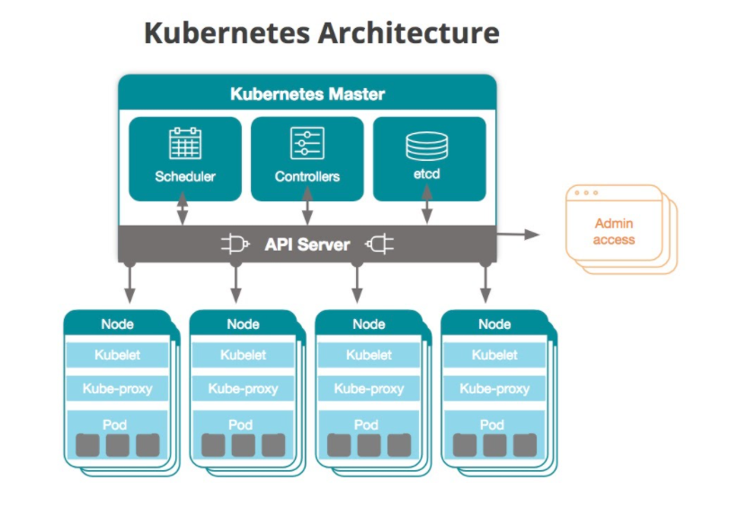

# Que es

Kubernetes es una plataforma de orquestación de contenedores de código abierto que automatiza y gestiona la implementación, el escalado y la gestión de aplicaciones en contenedores. Fue desarrollado por Google y ahora es mantenido por la Cloud Native Computing Foundation (CNCF).

Kubernetes permite a los desarrolladores y a los equipos de operaciones automatizar la implementación, la actualización y el escalado de aplicaciones en contenedores en diferentes entornos, como en la nube o en un centro de datos local. Ofrece características avanzadas, como la gestión de recursos, el equilibrio de carga y la gestión de almacenamiento, lo que facilita la creación y la gestión de aplicaciones escalables y altamente disponibles.

# Arquitectura

1. Master de Kubernetes: El Master es el componente principal de la arquitectura de Kubernetes. Es responsable de la gestión y control del clúster. El Master se compone de varios componentes, como el API Server, el Control Manager, el Scheduler y el Etcd.

2. Nodos: Los Nodos son las máquinas que ejecutan los contenedores y son los componentes que se encargan de la ejecución de las aplicaciones. Cada nodo tiene un agente llamado Kubelet que se comunica con el Master para recibir instrucciones.

3. Pods: Un Pod es la unidad más pequeña en la arquitectura de Kubernetes y se compone de uno o varios contenedores. Cada Pod tiene una dirección IP única y comparte los recursos del Nodo en el que se ejecuta.

4. Servicios: Los Servicios son los componentes que permiten la comunicación entre los Pods. Cada servicio tiene una dirección IP fija y se utiliza para enrutar el tráfico a los Pods correspondientes.

5. Volúmenes: Los Volúmenes son los componentes que permiten el almacenamiento persistente de los datos en Kubernetes. Los Volúmenes se utilizan para asegurar que los datos almacenados en los contenedores se mantengan disponibles incluso si los Pods se eliminan o se reinician.

6. Controladores: Los Controladores son los componentes que se utilizan para asegurar que los objetos en Kubernetes estén en el estado deseado. Por ejemplo, el Controlador de Replicación se utiliza para mantener un número determinado de réplicas de una aplicación en ejecución.

