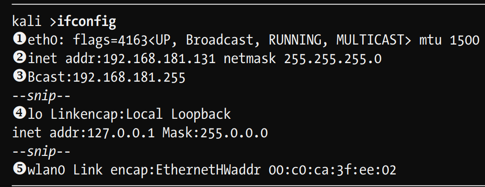

## Analizar networks
    ifconfig

1. indica el nombre de la primera intefaz detectada (eth0 o Ethernet 0), tipo de red
2. IP address
3. Broadcast address
4.loopback address or localhost
5. wlan0  es de wireless interface o adaptador , tiene la direccion mac

## revisar wireless network devices 

    iwconfig

# Chaging network information

    ifconfig eth0 [new_ip]