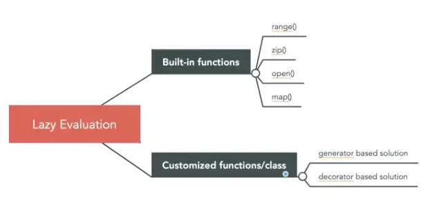

# Que es ?

estrategia de evaluacion, que retarda la evaluacion de una expresion  hasta que su valor es necesitado, evita evaluaciones duplicadas, es una estrategia para optimizar codigo.



Solo se realiza una operacion cuando es solicitada.

Por ejemplo la funcion range independientemente de el tamaño de range siempre tendra el mismo espacio en memoria , ya que solo almazena start,stop,step y calcula  cada elemento cuando se necesita

```Python
    >>> range(5)
    range(0, 5)
    >>> import sys
    >>> sys.getsizeof(range(5))
    48
    >>> sys.getsizeof(range(500))
    48
```

Iterator is an object whose class has a ```__next__``` and ```__iter__``` method. Every time you do ```next()``` call to the iterator object, you would get the next item in the sequence until the iterator object is exhausted and raise ```StopIteration```. However, generator is a function that returns an iterator. It looks like a normal function except that it uses ```yield``` instead of ```return```.

Como en la funcion range ,el valor solo sera calculado hasta que el valor se necesite.

## sintaxis 

```python
    def lazy_loading(items):
        for i in items:
            # you can have complex logic here
            yield i ** 2
    
    result = (i**2 for i in range(10))
```

## caso de uso - Patron de lazy-evaluated-property

Un caso de uso puede ser inicializar una clase , algunas propiedades pueden tomar un gran tiempo de calculo.

```python
# The slow way
class Person:
    def __init__(self, name, occupation):
        self.name = name
        self.occupation = occupation
        self.relatives = self._get_all_relatives()
        
    def _get_all_relatives():
        ...
        # This is an expensive operation

```

Una mejor estrategia , seria obtener ```relatives``` solo cuando es necesario.

```python
# Better
class Person:
    def __init__(self, name, occupation):
        self.name = name
        self.occupation = occupation
        self._relatives = None
        
    @property
    def relatives(self):
        if self._relatives is None:
            self._relatives = ... # Get all relatives
        return self._relatives
```

En este caso solo ejecuta la primera vez y despues es almacenado en ```self._relatives```

Un acercamiento mas ```pythonic``` es usar un decorador que haga una propiedad ```lazy evaluated```

```python
def lazy_property(fn):
    '''Decorator that makes a property lazy-evaluated.
    '''
    attr_name = '_lazy_' + fn.__name__

    @property
    def _lazy_property(self):
        if not hasattr(self, attr_name):
            setattr(self, attr_name, fn(self))
        return getattr(self, attr_name)
    return _lazy_property

class Person:
    def __init__(self, name, occupation):
        self.name = name
        self.occupation = occupation
        
    @lazy_property
    def relatives(self):
        # Get all relatives
        relatives = ...
        return relatives
```

Este patron es usado especialmente cuando tienes muchos atributos que deberan ser ```lazy evaluated```